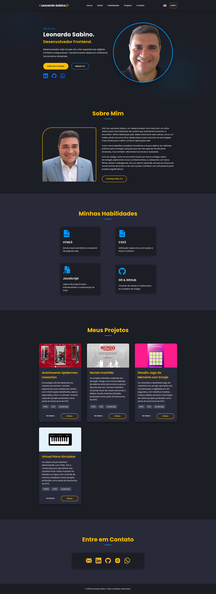
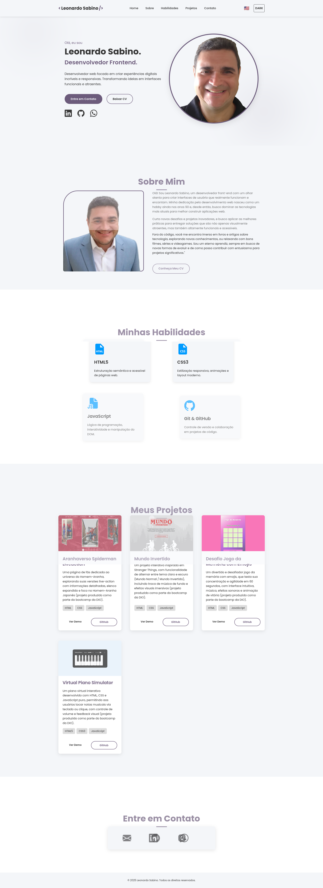
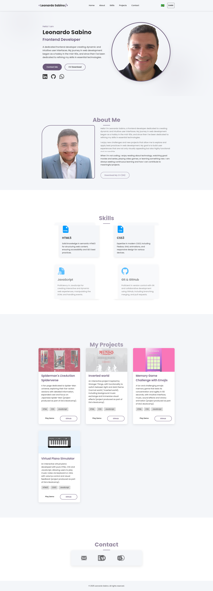
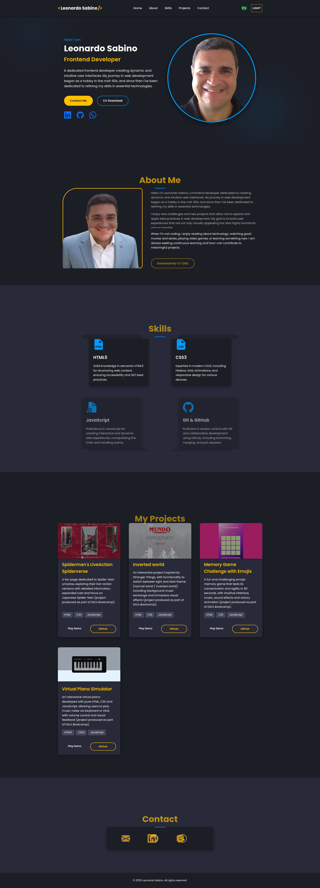

# Leonardo Sabino | Portfólio

Olá! Este é o meu portfólio pessoal, desenvolvido para apresentar minhas habilidades e projetos como Desenvolvedor Frontend. O objetivo principal deste projeto é demonstrar a capacidade de construir interfaces de usuário dinâmicas, responsivas e otimizadas, com foco em boas práticas de desenvolvimento web.

## Visão Geral do Projeto

Este portfólio foi construído com as tecnologias fundamentais do desenvolvimento web para garantir uma experiência de usuário moderna e fluida. Ele é projetado para ser intuitivo, visualmente atraente e acessível em diferentes dispositivos.

### Screenshot

Aqui está uma prévia do design do portfólio:






## Funcionalidades Principais

- **Design Responsivo:** O layout se adapta perfeitamente a diferentes tamanhos de tela (desktops, tablets, smartphones).
- **Temas Claro/Escuro:** Alternância de tema dinâmico para uma experiência de visualização personalizada, com persistência da preferência do usuário via `localStorage`.
- **Multi-idioma:** Suporte para Português (Brasil) e Inglês (EUA), permitindo que os visitantes troquem o idioma da interface. A implementação utiliza a troca de arquivos HTML para cada idioma, gerenciada via JavaScript.
- **Animações Suaves:** Elementos da página se animam elegantemente ao entrar na viewport, utilizando a Intersection Observer API para otimização.
- **Scroll Suave:** Navegação entre as seções da página com transições de scroll suaves.
- **Menu Mobile:** Um menu de navegação otimizado para dispositivos móveis.
- **Desabilitação de Seleção de Texto (Seletiva):** Implementação de `user-select: none;` no `body` para evitar a seleção de texto e objetos em todo o portfólio, garantindo uma experiência de interação mais controlada.
- **Otimização de Fontes:** Utilização de `preconnect` e `preload` para fontes Google Fonts para otimizar o carregamento.

## Tecnologias Utilizadas

- **HTML5:** Estrutura semântica do conteúdo.
- **CSS3:** Estilização moderna, incluindo Flexbox, Grid, variáveis CSS (`:root`), e media queries.
- **JavaScript (ES6+):** Lógica interativa, manipulação do DOM, controle de tema e idioma.

## Estrutura do Projeto

## Como Rodar Localmente

Para configurar e rodar este projeto em sua máquina local, siga os passos abaixo:

1.  **Clone o Repositório:**
    Abra seu terminal (ou Git Bash) e execute o seguinte comando:

    ```bash
    git clone [https://github.com/LeonardoSabino2025/portfolio.git](https://github.com/LeonardoSabino2025/portfolio.git)
    ```

2.  **Navegue até o Diretório do Projeto:**

    ```bash
    cd portfolio
    ```

3.  **Abra o `index.html` no Navegador:**
    Este é um projeto estático. Você pode simplesmente abrir o arquivo `index.html` diretamente no seu navegador.
    - No Windows, você pode clicar com o botão direito em `index.html` e selecionar "Abrir com" > "Seu navegador preferido".
    - Para uma experiência ideal (especialmente com módulos JavaScript e futuras integrações), é recomendado usar uma extensão de servidor local para VS Code (como "Live Server") ou um servidor HTTP simples.

## Versão Ao Vivo

Uma versão ao vivo e atualizada deste portfólio está disponível em:
[https://leonardosabino2025.github.io/portfolio/](https://leonardosabino2025.github.io/portfolio/)

---

## Contato

- **LinkedIn:** [Leonardo Sabino](https://www.linkedin.com/in/leonardo-sabino/)
- **GitHub:** [LeonardoSabino2025](https://github.com/LeonardoSabino2025)

## Licença

Este projeto está licenciado sob a Licença MIT.
